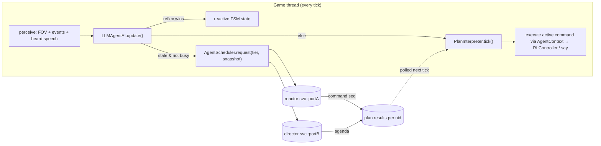
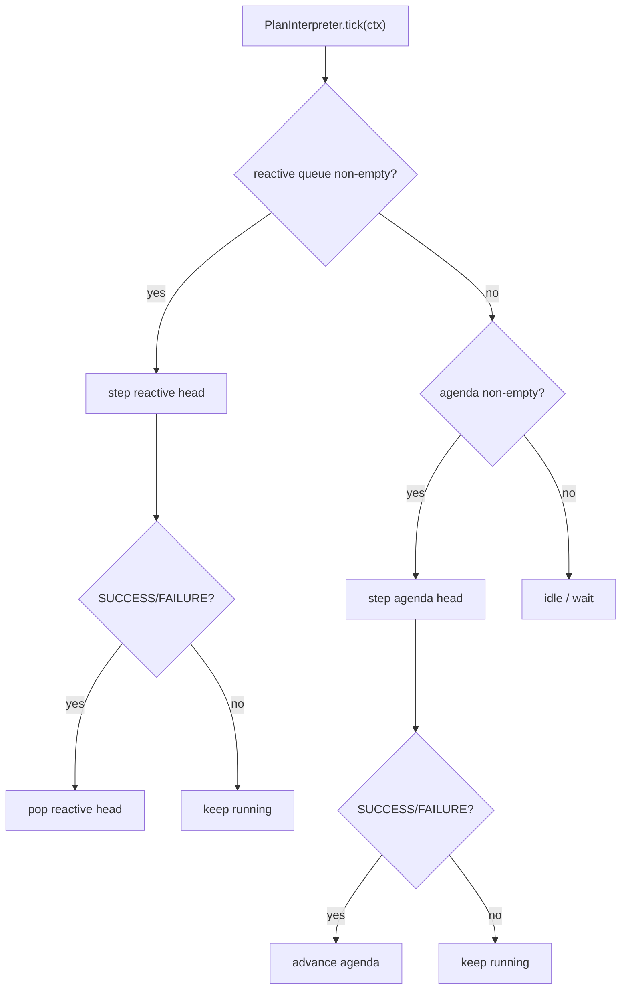
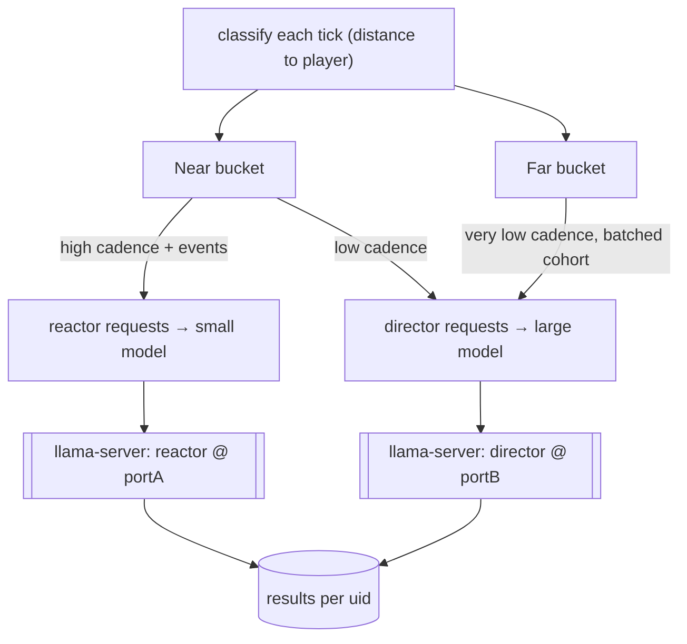

# Spec: LLM-driven NPC agency (native / local llama process)

Status: **finalized for implementation — revision 3**. Scope: desktop JVM build only.
WASM is deferred but the design must not foreclose it (§11).

All design decisions are locked (`[DECIDED]`). No open questions remain. Nothing is
implemented yet — this document is the build contract.

Revision history:
- r2: symbolic targets; command-pattern interpreter; two model tiers; two-bucket
  throttling; game-managed llama-server; config format under discussion.
- r3 (this): config = **JSON**; far-NPC nav uses the existing **milestone nav mesh**
  (cheap) with **teleport as an optional configurable optimization**; verbs =
  `goto/say/wait` for M1; memory = **sane defaults, configurable**; conversation =
  **emergent**; two-bucket **mode is a configurable toggle** (both modes supported);
  models **assumed present** + a **staging shell script**; test harness accepted.

---

## 1. Goal

Give town NPCs (`EntityRLHuman`) self-aware behavior — they hold jobs, commit crimes,
react to their sensors and environment, talk to each other, chat with the player, and
plan multi-step chains of action — driven by local llama processes, **without**
replacing the reactive FSM and **without** ever blocking the game tick.

Non-goals for this milestone:

- No multiplayer / networked inference.
- No vector DB / embeddings / RAG. Memory is a small hand-formatted string (§7).
- No per-tile movement from the LLM — the model picks **symbolic** targets; the
  milestone nav mesh + A* fallback route (§6). `[DECIDED]`
- No WASM backend yet (§11).

---

## 2. Current architecture (as-found)

- **Tick loop.** `WorldLayer.update()` (`WorldLayer.java:228-234`) iterates awake
  entities each frame on the **game thread**: `entity.update()` then, if `is_awake`,
  `entity.think()`. `EntityRLHuman.is_awake()` always returns `true`
  (`EntityRLHuman.java:192`). Anything slow here freezes the game.
- **AI contract.** `AI.update()` selects a `state` string; `AI.think()` runs that
  state's `IAIAction.act(NpcController)` (`BasicMobAI.java:56-68`).
- **Controller verbs** (`NpcController` / `RLController`): `set_destination(Point)`,
  `calculateAdaptivePath(src,tgt)`, `follow_path()`, `escapeTarget`, `chaseTarget`,
  `clearPath`, `hasPath`, `distanceToTarget`.
- **Speech.** `EntityActor.say_message(String)` posts `EChatMessage` — the in-game chat
  channel. NPCs within earshot can perceive it (basis for NPC↔NPC talk, §8).
- **Perception.** FOV via `RLTile.isVisible()` and `Fov.get_entity_in_radius(...)`;
  event bus via `e_on_event` (witness-crime, suspicious-sound, report-crime, murder).
- **AI assignment.** `TownChunkGenerator` calls `set_ai` + `set_controller(new
  RLController())` at 3 sites (`:422, :449, :501`).
- **Deps already present.** Gson + Java 17 `java.net.http.HttpClient`. **No new deps.**

---

## 3. Design overview: dual-process brain + command interpreter

Three layers, from fastest/dumbest to slowest/smartest:

1. **Reflex (FSM, every tick, game thread).** Existing reactive states — escape, chase,
   collision (`e_on_obstacle`). Always preempts. Never calls an LLM.
2. **Short-term reactor (small model, async, high cadence for near NPCs).** Emits a
   short **command sequence** reacting to current perception, within the current goal.
3. **Long-term director (large model, async, low cadence / batched).** Emits a coarse
   **agenda** (a goal + high-level command chain — go to work, work, go home, sleep).
   Distant NPCs poll only this tier.

Both LLM tiers emit **commands**, not a fixed struct. An interpreter executes them
tick-by-tick (§5). This is what makes multi-step chains and new verbs cheap to add.



**Thread-boundary invariant (load-bearing).** Worker threads touch **zero** game
objects. The game thread builds an immutable `String` snapshot, submits it; workers do
pure `String → parsed commands`; the game thread applies results next tick. World stays
single-threaded — no locks on game state.

---

## 4. Components

| Component | Thread | Responsibility |
|---|---|---|
| `LlamaServerManager` | game (startup/shutdown) | Spawn/monitor/terminate `llama-server` processes; health-check; JVM shutdown hook. `[DECIDED]` |
| `InferenceService` (iface) | — | `submit(uid,prompt)` / `poll(uid)` / `isBusy(uid)` / `shutdown()`. One instance per model tier. The **only** backend-specific seam (§11). |
| `LlamaHttpInferenceService` | worker | Single-thread executor + queue + `ConcurrentHashMap<uid,Result>`; calls `llama-server` `/completion` with GBNF; parses JSON→commands via Gson. |
| `AgentScheduler` | game | Owns the two buckets (§9); assigns cadence; enforces global concurrency caps; routes each request to reactor vs director service. |
| `CommandRegistry` | game | `verb → CommandFactory`. Assembles GBNF from fragments; parses JSON array → `List<NpcCommand>`. Add a verb here, nothing else changes (§5). |
| `PlanInterpreter` | game | Per-NPC. Runs agenda (base) + reactive (preempting) command queues tick-by-tick. |
| `AgentContext` | game | The command "tool surface": owner, `RLController`, symbol resolver (name→`Point`), world queries, memory. |
| `Perception` | game | Builds reactor snapshot (rich/local) and director snapshot (identity/role/coarse). |
| `LLMAgentAI extends BasicMobAI` | game | Wires reflex-override + interpreter tick + scheduler requests into the existing `update()`/`think()`. |
| `LlmConfig` | game | Loads json/properties (§10). `[DECIDED]` |

---

## 5. Command-pattern interpreter (replaces fixed AgentPlan) `[DECIDED]`

### 5.1 Interfaces

```
enum Status { RUNNING, SUCCESS, FAILURE }

interface NpcCommand {
    String verb();
    default void onEnter(AgentContext ctx) {}
    Status step(AgentContext ctx);        // called each tick while active
    default void onExit(AgentContext ctx) {}
}

interface CommandFactory {
    String verb();                        // "goto"
    String grammarFragment();             // GBNF alternative for this verb's JSON object
    NpcCommand parse(JsonObject args);    // JSON args → command instance
}
```

- **Durative** commands (`goto`, `work`, `sleep`) return `RUNNING` across many ticks
  until arrival/completion. **Instant** commands (`say`, `wait(0)`) return `SUCCESS` at
  once. Failure (blocked path, target gone) returns `FAILURE`.
- Registering a verb = one `CommandFactory` + one `NpcCommand`. `CommandRegistry`
  regenerates the grammar and parser automatically — **the interpreter, AI, and
  scheduler never change when verbs are added.**

### 5.2 Grammar is assembled, not hardcoded

`CommandRegistry.assembleGrammar()` concatenates each factory's `grammarFragment()` into
a GBNF that accepts a **JSON array of command objects**. The model therefore emits a
*program* (ordered commands), constrained so it can only use registered verbs with
valid argument shapes — no unparseable output, no hallucinated verbs.

### 5.3 Execution model: preemptive two-queue



- **Director** result replaces the **agenda** (base queue — the NPC's plan for the
  period).
- **Reactor** result replaces the **reactive** queue (preempts the agenda; when it
  drains, the agenda resumes).
- **Reflex** (escape/chase) still preempts *both* at the FSM level, above the
  interpreter.

### 5.4 Milestone verb set (start small, registry makes growth trivial)

`goto <symbol>`, `say <text>`, `wait <ticks>`. Roadmap verbs the design already
supports without core changes: `work`, `use <symbol>`, `pickup <symbol>`,
`attack <uid>`, `follow <uid>`, `sleep`, `steal <symbol>`.

**`[DECIDED]`** M1 ships `goto/say/wait` only — enough to prove the interpreter +
threading + multi-step chains. `work`/`use`/`attack`/`steal`/etc. are a fast follow;
the registry design means each is additive with no core changes.

---

## 6. Movement contract `[DECIDED]`

LLM sets a **symbolic** destination (named milestone, visible entity uid, or a keyword
like `home`/`work`). `AgentContext.resolve(symbol) → Point`. The `goto` command:
`calculateAdaptivePath` if `!hasPath()`, then `follow_path()`; returns `SUCCESS` on
arrival, `FAILURE` if unroutable. A* owns the route; the model never emits x,y.

---

## 7. Memory

Per-NPC, on the AI instance (serializes with the entity — `AI implements Serializable`):

- **Observation ring buffer** — last N short strings, fed from `e_on_event`, FOV deltas,
  and **heard speech** (§8): "saw player at market, night", "heard scream NE", "Bob
  said: the docks are dangerous".
- **Static facts** — name, sex, age, race, home apartment, job/role, relationships,
  `knowCriminals` (already tracked).

**`[DECIDED]`** Sane defaults, all configurable (§10): `llm.memory.observations = 8`,
reactor snapshot cap `llm.reactor.maxTokens = 512`, director snapshot cap
`llm.director.maxTokens = 1024`. The ring buffer drops oldest first; the snapshot
builder truncates observations to fit the cap.

---

## 8. NPC ↔ NPC and NPC ↔ player conversation

Emergent, no dedicated dialogue manager for M1: `say` posts `EChatMessage`; any NPC
within earshot records it as an observation, and its next plan may react (answer, walk
away, report). Turn-taking falls out of the perception→plan cadence.

**`[DECIDED]`** Emergent behavior — no dialogue manager, no turn-taking lock. `say`
posts `EChatMessage`; nearby NPCs record it as an observation and may react on their
next cadence. Focused exchanges, walking away, and reporting all emerge from perception
→ plan timing rather than hardcoded conversation state.

---

## 9. Two-bucket throttling `[DECIDED]`

Throttling mode is a **configurable toggle** (`llm.throttle.mode = buckets | uniform`) —
both modes are supported since the codebase will carry both anyway.

- `uniform`: every LLM-driven NPC uses one cadence, no near/far distinction (simplest;
  useful for the small-city case and for debugging).
- `buckets` (default): `AgentScheduler` classifies every LLM-driven NPC each tick by
  distance to the player:
  - **Near bucket (high priority)** — within `llm.near.radius`. Gets the **reactor** at
    high cadence (and event-triggered) **and** the **director** at low cadence.
  - **Far bucket (throttled)** — distant. **No reactor.** Polls only the **director** at
    very low cadence; director calls may be **batched** into one cohort prompt
    (`llm.director.batch = true`).

**Navigation cost — key correction.** The game already has a **pre-built milestone nav
mesh** (`RLWorldChunk.getMilestones()` / `getNearestMilestone()`, consumed by
`AdaptivePathfinder` via `RLController.calculateAdaptivePath`). NPCs route milestone-to-
milestone and fall back to A* only when that fails. So Far-NPC navigation is **already
cheap** — Far NPCs use the *same* nav-mesh routing as Near NPCs; the throttling saves
**inference** cost, not pathing cost.

**Teleport is an optional optimization** (`llm.far.teleport = false` by default). When
enabled, Far NPCs snap along their agenda milestones at coarse ticks (skipping smooth
tile movement) and reify exact position on promotion to Near. Off by default because the
nav mesh makes real movement affordable; on for very large crowds.

Promotion/demotion happens as the player moves. Global concurrency caps per tier;
**drop-if-busy** (one request per uid in flight) — the next eligible tick re-submits.



**`[DECIDED]` far-NPC fidelity:** Far NPCs move tile-accurately using the milestone nav
mesh (cheap). `llm.far.teleport` opt-in snaps them along milestones for very large
crowds. Exact position is reified on promotion to Near either way.

**`[DECIDED]` director batching:** cohort batching for the Far bucket
(`llm.director.batch = true`, one prompt plans the visible cohort — a true "AI director"
voice), single-NPC for Near. Configurable.

---

## 10. Model tiers, server lifecycle, config `[DECIDED]`

**Two tiers, two `llama-server` instances**, both spawned and torn down by the game:

- **Reactor** — small fast model (phi-4-mini 3.8B / Qwen2.5-3B), sub-second, near NPCs.
- **Director** — larger model (phi-4 14B), rare, long-term/batched planning.

`LlamaServerManager` starts both via `ProcessBuilder` on configured ports, polls
`/health` before marking ready, registers a JVM shutdown hook + `destroyForcibly`
fallback to terminate them. If a server is unavailable, the affected tier degrades
(reactor down → agenda-only; both down → `BasicMobAI` roaming). Game is fully playable
with inference disabled.

**Config** (`[DECIDED]` — **JSON**, parsed with the already-present Gson). Lives as an
**external file next to the run script** (`llm-config.json`) so users edit models,
ports, and cadences without rebuilding; a checked-in default template ships at
`serialkiller/src/main/resources/resources/llm/config.json` and is copied out by the
staging script (§10.1). External file wins if present.

```json
{
  "enabled": true,
  "serverBinary": "/usr/local/bin/llama-server",
  "reactor":  { "model": "models/phi-4-mini.gguf", "port": 8081,
                "cadenceMs": 4000,  "maxTokens": 512 },
  "director": { "model": "models/phi-4.gguf",      "port": 8082,
                "cadenceMs": 60000, "maxTokens": 1024, "batch": true },
  "throttle": { "mode": "buckets", "nearRadius": 24 },
  "far":      { "teleport": false },
  "memory":   { "observations": 8 }
}
```

**`[DECIDED]` models on disk:** `LlamaServerManager` assumes the `.gguf` files exist at
the configured paths. Getting them there is `ModelDownloader`'s job (§10.1); the shell
script stays available for pre-staging offline boxes.

### 10.1 Model staging

Each tier carries the `url` its `model` is fetched from, so the game and the script stage
identical files.

**In-engine (default).** `LoadingMode` runs before the world exists: `ModelDownloader`
fetches any missing model on a worker thread while the render loop draws a progress bar,
then `LlmRuntime.init()` boots the tier — so the llama-server wait is on screen instead of
frozen behind a black window. Bytes land in `<model>.part` and are renamed into place only
when complete, so an interrupted run resumes (`Range:`) rather than restarting; transfers
get 3 attempts, HTTP errors none. If staging fails the screen says so and the game starts
with `LlmRuntime.disable()` — FSM NPCs, no minute-long stall waiting on a server that
cannot come up. `-Dllm.enabled=false` skips the whole phase (used by `scripts/shot.sh`).

**`scripts/stage-llm-models.sh`.** Same downloads ahead of time (both tiers, not just the
reactor) plus seeding `llm-config.json` from the template. Idempotent; skips present files.
(Mirrors the existing self-contained-build ethos, e.g. `scripts/install-local-jars.sh`.)

---

## 11. WASM seam (deferred, not built)

Only `InferenceService` + `LlamaServerManager` are backend-specific. WASM later provides
an alternate `InferenceService` (WebLLM / llama.cpp-wasm in a Web Worker, or a remote
endpoint) and a no-op server manager. `CommandRegistry`, `PlanInterpreter`, `NpcCommand`,
`AgentContext`, `Perception`, `LLMAgentAI`, and the assembled grammar are all
backend-agnostic and unchanged. No `java.net.http` usage leaks past the native impl.

---

## 12. Failure handling (lean, per repo conventions)

- Timeout / connection refused / non-200 → `poll()` returns null; NPC keeps its last
  agenda or idles. Debug-logged, not spammed.
- Grammar guarantees parseable output; on residual parse failure, drop and re-submit
  next cadence.
- Tier down → graceful degradation as in §10.

---

## 13. Milestone-1 slice (smallest thing that proves the loop)

1. `LlamaServerManager` spawning **one** server (reactor tier only) + shutdown hook.
2. `InferenceService` + `LlamaHttpInferenceService` (GBNF-constrained).
3. `CommandRegistry` + `PlanInterpreter` + `AgentContext` with verbs `goto/say/wait`.
4. `Perception.snapshot()` = identity + time-of-day + nearby visible ents + last 3 obs.
5. `LLMAgentAI` on **one** hand-placed NPC; near-bucket only (defer director + far
   bucket to M2).
6. Verify: NPC executes a multi-step command chain (goto → say → wait → goto),
   context-aware speech, never stalls the frame with inference off or on.

Milestone 2: director tier + second server + two-bucket scheduler + cohort batching.

**`[DECIDED]` test surface:** headless harness that ticks N frames with a **stub
`InferenceService`** returning canned command JSON, asserting the NPC moved / spoke /
chained correctly (deterministic, no model needed in CI), plus manual in-game
confirmation against the real `llama-server`.

---

## 14. Files (planned; nothing written yet)

```
serialkiller/.../game/ai/llm/
    InferenceService.java            (interface)
    LlamaHttpInferenceService.java
    LlamaServerManager.java
    AgentScheduler.java
    LlmConfig.java
serialkiller/.../game/ai/llm/command/
    NpcCommand.java                  (interface + Status)
    CommandFactory.java              (interface)
    CommandRegistry.java
    PlanInterpreter.java
    AgentContext.java
    commands/GotoCommand.java, SayCommand.java, WaitCommand.java
serialkiller/.../game/ai/llm/
    Perception.java
serialkiller/.../game/ai/LLMAgentAI.java
serialkiller/.../game/ai/llm/ModelDownloader.java   (fetches missing GGUFs on start)
serialkiller/.../game/modes/loading/                (LoadingMode + LoadingUI: staging screen)
serialkiller/src/main/resources/resources/llm/
    config.json                      (default template; copied to ./llm-config.json)
    (grammar is assembled at runtime from the registry, not a static file)
scripts/stage-llm-models.sh          (pre-stage GGUFs offline, seed llm-config.json)
one spawn-site edit in TownChunkGenerator (behind config "enabled")
```

### 14.1 Config resolution order

1. External `llm-config.json` next to the run script (user-editable, wins).
2. Bundled `resources/llm/config.json` template (fallback default).
3. `enabled=false` or file absent → NPCs stay on `PedestrianAI`; game unaffected.
