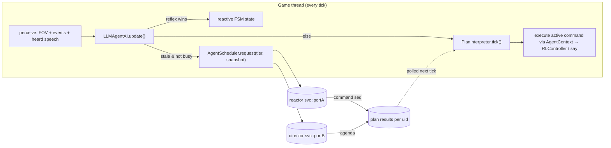
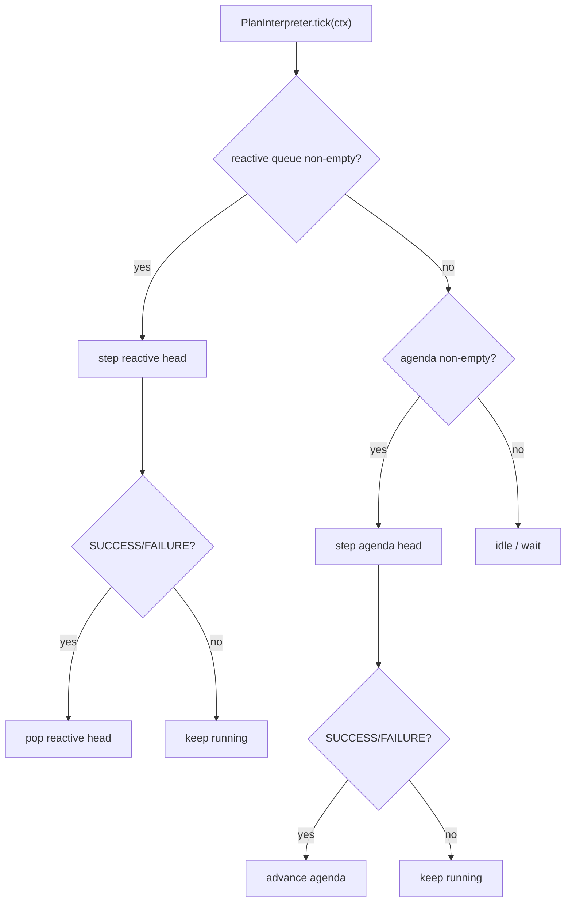
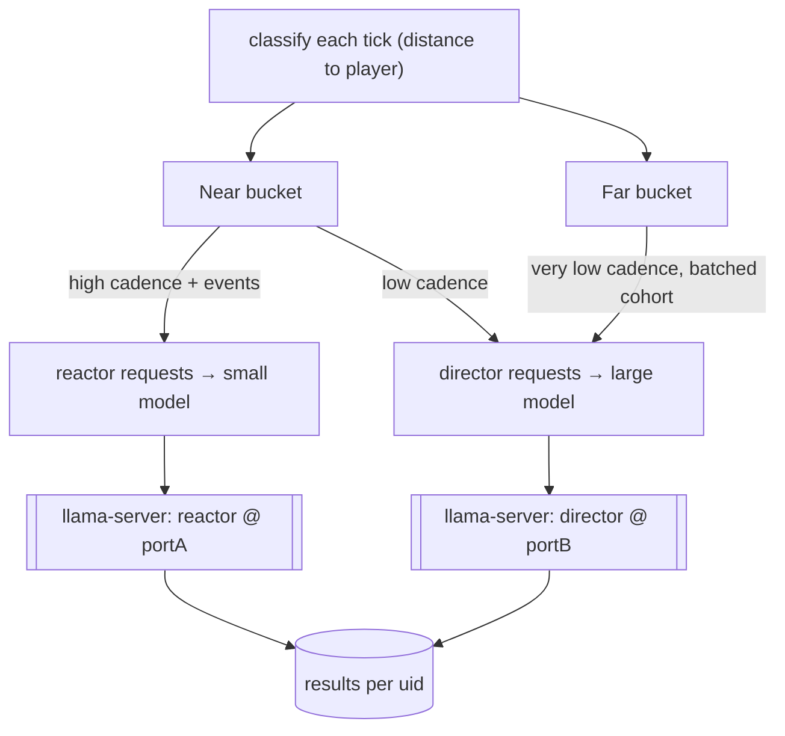

# Spec: LLM-driven NPC agency (native / local llama process)

Status: **finalized for implementation — revision 3**. Scope: desktop JVM build only.
WASM is deferred but the design must not foreclose it (§11).

All design decisions are locked (`[DECIDED]`). No open questions remain. Nothing is
implemented yet — this document is the build contract.

Revision history:
- r2: symbolic targets; command-pattern interpreter; two model tiers; two-bucket
  throttling; game-managed llama-server; config format under discussion.
- r3 (this): config = **JSON**; far-NPC nav uses the existing **milestone nav mesh**
  (cheap) with **teleport as an optional configurable optimization**; verbs =
  `goto/say/wait` for M1; memory = **sane defaults, configurable**; conversation =
  **emergent**; two-bucket **mode is a configurable toggle** (both modes supported);
  models **assumed present** + a **staging shell script**; test harness accepted.

---

## 1. Goal

Give town NPCs (`EntityRLHuman`) self-aware behavior — they hold jobs, commit crimes,
react to their sensors and environment, talk to each other, chat with the player, and
plan multi-step chains of action — driven by local llama processes, **without**
replacing the reactive FSM and **without** ever blocking the game tick.

Non-goals for this milestone:

- No multiplayer / networked inference.
- No vector DB / embeddings / RAG. Memory is a small hand-formatted string (§7).
- No per-tile movement from the LLM — the model picks **symbolic** targets; the
  milestone nav mesh + A* fallback route (§6). `[DECIDED]`
- No WASM backend yet (§11).

---

## 2. Current architecture (as-found)

- **Tick loop.** `WorldLayer.update()` (`WorldLayer.java:228-234`) iterates awake
  entities each frame on the **game thread**: `entity.update()` then, if `is_awake`,
  `entity.think()`. `EntityRLHuman.is_awake()` always returns `true`
  (`EntityRLHuman.java:192`). Anything slow here freezes the game.
- **AI contract.** `AI.update()` selects a `state` string; `AI.think()` runs that
  state's `IAIAction.act(NpcController)` (`BasicMobAI.java:56-68`).
- **Controller verbs** (`NpcController` / `RLController`): `set_destination(Point)`,
  `calculateAdaptivePath(src,tgt)`, `follow_path()`, `escapeTarget`, `chaseTarget`,
  `clearPath`, `hasPath`, `distanceToTarget`.
- **Speech.** `EntityActor.say_message(String)` posts `EChatMessage` — the in-game chat
  channel. NPCs within earshot can perceive it (basis for NPC↔NPC talk, §8).
- **Perception.** FOV via `RLTile.isVisible()` and `Fov.get_entity_in_radius(...)`;
  event bus via `e_on_event` (witness-crime, suspicious-sound, report-crime, murder).
- **AI assignment.** `TownChunkGenerator` calls `set_ai` + `set_controller(new
  RLController())` at 3 sites (`:422, :449, :501`).
- **Deps already present.** Gson + Java 17 `java.net.http.HttpClient`. **No new deps.**

---

## 3. Design overview: dual-process brain + command interpreter

Three layers, from fastest/dumbest to slowest/smartest:

1. **Reflex (FSM, every tick, game thread).** Existing reactive states — escape, chase,
   collision (`e_on_obstacle`). Always preempts. Never calls an LLM.
2. **Short-term reactor (small model, async, high cadence for near NPCs).** Emits a
   short **command sequence** reacting to current perception, within the current goal.
3. **Long-term director (large model, async, low cadence / batched).** Emits a coarse
   **agenda** (a goal + high-level command chain — go to work, work, go home, sleep).
   Distant NPCs poll only this tier.

Both LLM tiers emit **commands**, not a fixed struct. An interpreter executes them
tick-by-tick (§5). This is what makes multi-step chains and new verbs cheap to add.



**Thread-boundary invariant (load-bearing).** Worker threads touch **zero** game
objects. The game thread builds an immutable `String` snapshot, submits it; workers do
pure `String → parsed commands`; the game thread applies results next tick. World stays
single-threaded — no locks on game state.

---

## 4. Components

| Component | Thread | Responsibility |
|---|---|---|
| `LlamaServerManager` | game (startup/shutdown) | Spawn/monitor/terminate `llama-server` processes; health-check; JVM shutdown hook. `[DECIDED]` |
| `InferenceService` (iface) | — | `submit(uid,prompt)` / `poll(uid)` / `isBusy(uid)` / `shutdown()`. One instance per model tier. The **only** backend-specific seam (§11). |
| `LlamaHttpInferenceService` | worker | Single-thread executor + queue + `ConcurrentHashMap<uid,Result>`; calls `llama-server` `/completion` with GBNF; parses JSON→commands via Gson. |
| `AgentScheduler` | game | Owns the two buckets (§9); assigns cadence; enforces global concurrency caps; routes each request to reactor vs director service. |
| `CommandRegistry` | game | `verb → CommandFactory`. Assembles GBNF from fragments; parses JSON array → `List<NpcCommand>`. Add a verb here, nothing else changes (§5). |
| `PlanInterpreter` | game | Per-NPC. Runs agenda (base) + reactive (preempting) command queues tick-by-tick. |
| `AgentContext` | game | The command "tool surface": owner, `RLController`, symbol resolver (name→`Point`), world queries, memory. |
| `Perception` | game | Builds reactor snapshot (rich/local) and director snapshot (identity/role/coarse). |
| `TownAI extends BasicMobAI` | game | Composition root: owns `Knowledge`, `Voice` and `Deliberation`, selects a state from its subclass's impulses, runs the matching action. `PedestrianAI` and `PoliceAI` differ only in which impulses they register (§8.6). |
| `Deliberation` | game | The LLM planner as a *component*, not a brain: pumps the inference queue, runs the plan when no reflex wants the body. Absent entirely when inference is off. |
| `Knowledge` / `Percept` | game | Working memory: the ranked stimulus stream plus one belief per person, carrying when it was last seen and whether that is firsthand or hearsay (§8.6). |
| `LlmConfig` | game | Loads json/properties (§10). `[DECIDED]` |

---

## 5. Command-pattern interpreter (replaces fixed AgentPlan) `[DECIDED]`

### 5.1 Interfaces

```
enum Status { RUNNING, SUCCESS, FAILURE }

interface NpcCommand {
    String verb();
    default void onEnter(AgentContext ctx) {}
    Status step(AgentContext ctx);        // called each tick while active
    default void onExit(AgentContext ctx) {}
}

interface CommandFactory {
    String verb();                        // "goto"
    String grammarFragment();             // GBNF alternative for this verb's JSON object
    NpcCommand parse(JsonObject args);    // JSON args → command instance
}
```

- **Durative** commands (`goto`, `work`, `sleep`) return `RUNNING` across many ticks
  until arrival/completion. **Instant** commands (`say`, `wait(0)`) return `SUCCESS` at
  once. Failure (blocked path, target gone) returns `FAILURE`.
- Registering a verb = one `CommandFactory` + one `NpcCommand`. `CommandRegistry`
  regenerates the grammar and parser automatically — **the interpreter, AI, and
  scheduler never change when verbs are added.**

### 5.2 Grammar is assembled, not hardcoded

`CommandRegistry.assembleGrammar()` concatenates each factory's `grammarFragment()` into
a GBNF that accepts a **JSON array of command objects**. The model therefore emits a
*program* (ordered commands), constrained so it can only use registered verbs with
valid argument shapes — no unparseable output, no hallucinated verbs.

### 5.3 Execution model: preemptive two-queue



- **Director** result replaces the **agenda** (base queue — the NPC's plan for the
  period).
- **Reactor** result replaces the **reactive** queue (preempts the agenda; when it
  drains, the agenda resumes).
- **Reflex** (escape/chase) still preempts *both* at the FSM level, above the
  interpreter.

### 5.4 Milestone verb set (start small, registry makes growth trivial)

`goto <symbol>`, `say <text>`, `wait <ticks>`. Roadmap verbs the design already
supports without core changes: `work`, `use <symbol>`, `pickup <symbol>`,
`attack <uid>`, `follow <uid>`, `sleep`, `steal <symbol>`.

**`[DECIDED]`** M1 ships `goto/say/wait` only — enough to prove the interpreter +
threading + multi-step chains. `work`/`use`/`attack`/`steal`/etc. are a fast follow;
the registry design means each is additive with no core changes.

---

## 6. Movement contract `[DECIDED]`

LLM sets a **symbolic** destination (named milestone, visible entity uid, or a keyword
like `home`/`work`). `AgentContext.resolve(symbol) → Point`. The `goto` command:
`calculateAdaptivePath` if `!hasPath()`, then `follow_path()`; returns `SUCCESS` on
arrival, `FAILURE` if unroutable. A* owns the route; the model never emits x,y.

---

## 7. Memory

Per-NPC, on the AI instance (serializes with the entity — `AI implements Serializable`):

- **Observation ring buffer** — last N short strings, fed from `e_on_event`, FOV deltas,
  and **heard speech** (§8): "saw player at market, night", "heard scream NE", "Bob
  said: the docks are dangerous".
- **Static facts** — name, sex, age, race, home apartment, job/role, relationships,
  `knowCriminals` (already tracked).

**`[DECIDED]`** Sane defaults, all configurable (§10): `llm.memory.observations = 8`,
reactor snapshot cap `llm.reactor.maxTokens = 512`, director snapshot cap
`llm.director.maxTokens = 1024`. The snapshot builder truncates observations to fit the cap.

### 7.1 Salience: how competing signals resolve `[DECIDED]` (r4)

Observations were originally plain strings in a drop-oldest ring buffer. That carried no
priority, so nothing in the system could express *"this outranks what you are doing"* —
and NPCs did not react to the player. Every sensor now emits a `Stimulus`
(`turn`, `channel`, `salience`, `sourceUid`, `text`) on one 0-100 scale:

| Band | Value | Meaning |
|---|---|---|
| `AMBIENT` | 10 | FOV churn, chunk changes |
| `NOTABLE` | 40 | overheard speech, a crime seen nearby |
| `DIRECTED` | 70 | someone addressed **you** |
| `URGENT` | 95 | attacked, witnessed a murder |

The same number arbitrates **three** layers — it inverts somewhere if they disagree:

1. **Memory** (`StimulusMemory`) evicts the *least salient*, not the oldest, so ambient
   churn can never push out a line spoken to your face. Salience decays by
   `priority.decayPerTurn` so nothing stays urgent forever.
2. **Queue** (`LlamaHttpInferenceService`) serves highest-salience first, bounded, and
   drops the weakest under saturation. *This is load-bearing:* CPU inference costs 1-3s
   per request while a whole near-bucket submits every few turns, so the queue runs
   permanently backed up. A FIFO makes arrival order the arbiter and the NPC a human is
   talking to answers minutes late or never.
3. **Trigger** (`LLMAgentAI`) — a stimulus at or above `priority.interruptAt` drops the
   running plan and submits immediately, bypassing both the idle check and the cadence.
   Below it, the old rule applies: re-plan only when idle and the cadence has elapsed.

`interruptAt` must sit **below** the band it is meant to catch, because the comparison
happens after decay (r5). Set to 70 — exactly `DIRECTED` — a directed stimulus was at 68
one turn later and never interrupted at all: the threshold had a window of zero turns. At
60 with decay 2/turn, being spoken to preempts for ~5 turns and being attacked for ~17,
after which they are memory rather than emergency. For the same reason, debug lines label
a stimulus by its **own** band, not by its decayed score.

Stimuli are marked consumed at **submit** time, not reply time — a round trip takes
seconds, and an unconsumed stimulus re-fires the interrupt every turn until then.

**Cadence is counted in turns, not milliseconds.** The world only advances when the player
acts, so a wall clock throttles a player standing still and outruns one holding shift.
`GameTurn` advances once per `InGameMode.makeTurn()`; **speaking costs a turn**, so the NPC
being addressed actually gets to think.

**Prompt structure follows salience.** The top unconsumed stimulus gets its own
`RIGHT NOW:` block with an explicit instruction; ambient entries are dropped from the
prompt entirely. Measured on phi-4-mini with the flat list, 7/12 completions came back as
an empty command array (silently dropped → NPC does nothing); restructured, 0/12 empty and
12/12 answered.

**Attention (§8) instead of a dialogue manager.** Being addressed sets
`attentionUid` for `priority.attentionTurns`; while held, cadence tightens to
`attentionCadenceTurns` and the prompt says to stay put and keep talking. Turn-taking
still emerges from timing — no conversation state machine.

**Reflex rung `[DECIDED]` (r5).** Survival does not go through the model. A `PAIN` stimulus
engages a reflex *the moment it lands* — same turn as the blow, no inference: scream, drop
the running plan, and run from the attacker for `priority.fleeTurns` or until
`priority.fleeDistance` clear. The interpreter does not get the body while it holds.

This is a latency argument, not a taste one. Routed through the model, a stab became a
prompt, a round trip and then *dialogue*: the victim stood next to their attacker
discussing it for a dozen turns while the plan it produced (`goto home`) failed to resolve
and never moved them at all. The model still speaks — it just narrates the panic instead
of gating it.

Fleeing **routes**, it does not step. `NpcController.escapeTarget()` walks directly away
from the threat, which indoors means into a wall: measured, the victim got two tiles and
then jammed in a corner for the remaining eight turns. The reflex instead picks the nav-mesh
milestone furthest from the threat *within `SEARCH_RADIUS`* and paths to it, so panic leads
out through doors. The radius matters — scoring distance globally picks the far corner of
the map and A* refuses a route that long, which silently degrades back to the jammed corner.

The ladder is now reflex > URGENT > DIRECTED > ambient. The chase half of the FSM (§3
layer 1) is still bypassed; only escape is wired.

---

## 8. NPC ↔ NPC and NPC ↔ player conversation

Emergent, no dedicated dialogue manager for M1: `say` posts `EChatMessage`; any NPC
within earshot records it as an observation, and its next plan may react (answer, walk
away, report). Turn-taking falls out of the perception→plan cadence.

**`HearingSensor` (r4)** is the one subscriber that makes this real. It turns every
`EChatMessage` into a ranked stimulus for whoever is in earshot, with **distance setting
the band**: within `speech.directedRadius` you are being *addressed* (`DIRECTED`, preempts
the running plan); out to `speech.earshotRadius` you merely *overheard* it (`NOTABLE`,
remembered, not urgent). Proximity is what gives conversation focus without a dialogue
manager. The player is just another speaker — previously player speech was hand-delivered
from `InGameMode` as a special case, and NPC speech reached nobody at all, which is why
NPCs never answered each other.

Radius alone left a **dead band** (r5): "standing near someone" in a room is 5–10 tiles,
but only `directedRadius` (4) counted as addressed, so a deliberate hello landed as
`NOTABLE` and never crossed the interrupt threshold. Player speech therefore also promotes
the **nearest hearer** to `DIRECTED` regardless of distance. The player types a line rarely
and on purpose; NPC chatter is ambient, so the rule is not symmetric.

**`PainSensor` (r5)** is the `PAIN` channel's producer, which until now did not exist.
`ETakeDamage` was a client-side FX cue — the floating damage number — and nothing routed it
to the victim's brain, so being attacked was, to an LLM NPC, silence. It now enters as
`URGENT` carrying the attacker's uid (so the victim holds attention on whoever hit them),
and anyone within earshot gets a `NOTABLE` *"you just saw X attack Y"* — a real witness
signal in place of the anonymous crime-report broadcast.

**Sensors name people by relation, not by string (r5).** Every stimulus is phrased from the
observer's side via `Relations.describe()`, so the same speaker is *"your daughter GENNY
FAULKNER"* to one listener and a bare name to the next. The world has generated families
since long before the LLM work — mate, children, siblings, all wired bidirectionally — and
none of it reached a prompt, so being shouted at by a stranger and by your wife were the
same event with different text. Witnessing kin take a hit also enters at `URGENT` rather
than `NOTABLE`. The witness channel fires only for violence against **people**: every swing
at a crate raises `ETakeDamage` too, and *"you saw your husband attack crate"* is not a
social event.

The household was also incoherent to begin with: the player was named literally `Player`,
the mate carried an unrelated generated surname, and each child a further one. One
`FamilyGenerator` surname now covers the whole household. They were homeless too — no
`setApartment`, so every `goto home` they planned resolved to `UNRESOLVED` and failed.

**Every NPC needs a brain to sense with (r5).** Four spawn sites each rolled their own
AI assignment and one forgot: the player's own family, in the building the player *starts
in*, got `set_combat` but never `set_ai` or `set_controller`. Those NPCs are inert — no AI
means no sensors, so speech and violence both land on nothing, which is exactly what
"the NPC in the starting building ignores me" was. All sites now go through
`TownChunkGenerator.giveBrain()`.

### 8.1 Speech is ordered, ranked memory is not `[DECIDED]` (r6)

Salience ranking is right for deciding *what to react to* and wrong for *holding a
conversation*: a ranked bag has no notion of who spoke last. `DialogueLog` sits alongside
`StimulusMemory` and keeps the last `memory.dialogueLines` utterances in the order they
happened, each attributed, with overheard lines marked as such. The stimulus still decides
whether to react and how hard; the transcript is what a reply is built from.

An NPC's own speech was recorded **nowhere at all** — `HearingSensor` skips the speaker and
the prompt never said what the NPC had just said — so every re-plan opened cold on the same
scene. Observed: an NPC answered the player, then two turns later greeted them again with
*"sorry, I didn't hear you come in"*. `AgentContext.say()` is the single speech funnel and
now writes back into the speaker's own log.

Attribution also does work the bulleted list could not. Overheard lines arrived as
*"- you overheard X say: Y"* among other bullets, and a 3.8B model copies the nearest quoted
string: one NPC repeated, as her own line, a sentence another NPC had said *about her*.
Speech stimuli are therefore dropped from the background block once a transcript exists —
they are in it already, in a form much harder to mistake for something to repeat.

### 8.2 A plan is not a list of drafts `[DECIDED]` (r6)

Asked for a *plan*, a small model answers a conversational prompt with several alternative
**drafts of the same line**. The interpreter runs one command per turn, so four `say`s
became a four-turn monologue that contradicted itself ("just a moment, I was getting ready
for bed" / "I'm actually sleeping right now"). `speech.maxSaysPerPlan` (default 1) caps it
at parse time — a runtime value, so it is enforced in `CommandRegistry.parse` rather than in
the grammar, which is assembled once. `speech.maxSayChars` (default 110) clips the line to a
sentence boundary: NPC speech renders in a bubble over the head, and a model told to "speak
in short sentences" still returns paragraphs. The instruction is advice; the clip is the
rule. `DialogueLog.alreadySaid()` is the last-resort guard against literal repetition.

### 8.3 Idle is not a reason to talk `[DECIDED]` (r6)

The ambient re-plan fired on `isIdle() && cadence elapsed`, with no requirement that
anything had *happened*. Combined with `attentionCadenceTurns = 2` and a prompt ending in
"never reply with an empty array", an NPC standing near the player was asked every other
turn to produce something out of nothing — and what it produced was almost always talking.
`StimulusMemory.lastAddedTurn()` gives the re-plan an activity clock: nothing sensed since
the last submit drops the cadence to `priority.idleCadenceTurns` (default 30). Eviction and
consumption both erase the evidence that something arrived, which is why the clock has to be
separate from the entries. Cold start is unaffected — an NPC that has never planned still
plans immediately.

### 8.4 A condition is not an event `[DECIDED]` (r7)

Everything the prompt carried was something that *happened*, and happenings decay. Stab a
family member and she screams, runs — and thirty seconds later answers "everything is fine,
what happened?", because by then the assault is a past-tense bullet under `Background` while
the small talk in front of her holds the `RIGHT NOW` slot. Four separate mechanisms conspired,
and all four are the same mistake in different places:

- **`peekTop()` skips consumed stimuli.** Being *prompted* about a stabbing once does not make
  it stop being true, but it dropped out of the block that frames the prompt, so a chat line
  worth a third as much took the lead. Triggering a re-plan needs *unconsumed*; framing the
  prompt needs *strongest*. `peekStrongest()` is the second question, and the two are rendered
  together — the emergency leads, the question that triggered the re-plan follows it.
- **The victim's own state was nowhere in the prompt.** Not wounded, not fleeing, not afraid
  of anyone. `Perception.appendCondition()` states it directly, and it holds as long as the
  condition does rather than decaying at 2/turn.
- **Being attacked set the attacker as your conversation partner.** `engageReflex` called
  `focusOn`, so a stabbing registered as the opening of a conversation and the prompt then
  told the victim to *"stay where you are and keep talking, do not walk off"*. Conversation
  focus comes from the SPEECH channel and nothing else; being attacked now clears it.
- **The reflex silenced the plan it was reacting to.** While fleeing, the interpreter never
  ticks, so a line composed mid-attack sat in the queue for seven turns and was delivered to
  a street the attacker had left. Running away does not make you mute: `flushSpeech()` lets a
  plan contribute its line and discards the rest, and `priority.planTtlTurns` throws away any
  plan that never got the body in time.

One more fell out of the fix. `root ::= "[" ws ( command tail )? ws "]"` made the empty array
*grammatical*, and "never reply with an empty array" was only ever an instruction — handed a
genuinely hard prompt, phi-4-mini answered `[]`, silence exactly when there was most to react
to. The first command is now mandatory in the grammar.

Measured against the recorded session that prompted this, same input stream: the victim now
shouts "Help me, please, he hurt me!" *while running*, and answers "why are you screaming"
with "He attacked me! Help me!" one turn later instead of "I didn't hear anything" eight
turns later.

### 8.5 A role is not a name, and safety is not a stopwatch `[DECIDED]` (r8)

Two reflex bugs, both of them the same shape: layer 1 (§3) was written once, for one kind of
person, and then asked to cover everyone.

**Panic ran on a timer.** `fleeUntilTurn = now + fleeTurns` was a *budget*, so a victim ran
for ten turns, the player walked after her at exactly the same speed, and on turn eleven she
stopped and went back to her errands with him standing next to her — measured at `dist`
`1,2,1,1,1,1,1,2,3,2` for the whole flee. The deadline is now a **grace period**, pushed
forward on every turn the attacker is still within `fleeDistance`; you stop running when you
are clear, not when the clock says so. `fleeMaxTurns` caps one panic so a cornered NPC
eventually gets its plan back, and the next blow re-engages the reflex on the same turn.

**Switching the LLM on disbanded the police force.** `TownChunkGenerator` spawned policemen
with `new LLMAgentAI()` in place of `PoliceAI` — same uniform, same stunstick, and none of
the behaviour: no investigation, no chase, no strike on contact. What replaced it was the
civilian brain, so an officer watched an assault happen in front of him, and when the
attacker turned on him he screamed and ran. The first fix for this added a `Role` enum
consulted by the prompt, the pain sensor, the crime handler and the reflex; §8.6 explains
why that was the wrong shape and what replaced it.

### 8.6 One brain per kind of person `[DECIDED]` (r9)

`Role` lasted one revision. It answered "is this NPC a policeman" at four call sites, which
is four chances to disagree, and the fifth site — the spawn point — still handed policemen
the civilian brain whenever inference was on. A role flag is what you reach for when
behaviour cannot vary by type; this codebase already had `PedestrianAI` and `PoliceAI`, so
it could.

The architecture is now the standard one, and each piece is standard for a reason:

| Layer | What it does | Prior art |
|---|---|---|
| `Impulse` | Named trigger; selection walks them in priority order and takes the first relevant one | Halo 2 impulses + prioritised-list decision (Isla, GDC 2005) |
| `IAIAction` | One behaviour, with `onEnter`/`onExit`/`onObstacle` | Halo 2 behaviours with per-behaviour short-term memory |
| `Knowledge` | Ranked stimulus stream + a `Percept` per person, with a firsthand/hearsay distinction | F.E.A.R. working memory (Orkin, GDC 2006); Halo 2 *props*; Thief *sense links* (Leonard, GDC 2003) |
| `Voice` | Every line spoken, and the record of having spoken it | — |
| `Deliberation` | The LLM planner, one rung below every reflex | Brooks' subsumption (1986): a higher layer suppresses the ones under it |
| `SocialController` | Town-wide crime board and police dispatch | F.E.A.R. squad blackboard; Thief peer propagation of sense links |

**The role difference is now three lines in a constructor.** `PoliceAI` removes the inherited
`threat` and `night` impulses — an officer does not flee a criminal and does not go home at
dusk — and registers `suspect` (pursue) and `crime scene` (investigate) in their place. The
prompt persona lives in the same file as the behaviour it describes, so the two cannot
disagree about what a policeman is.

**Arrest is a reflex, not a plan.** The verb set is `goto/say/wait`; the model said *"I'm
taking him into custody"* and *"I need to call for backup"* with nothing behind either.
`PursueAction` takes the body, closes on the suspect, and lets contact do the rest: walking
into an occupied tile is how every melee in this game already happens, so `onObstacle` is the
whole attack. Adding an `attack` verb was considered and rejected — policing should not wait
on a round trip, and a general combat verb hands every NPC in town the ability to choose
violence, which is a much larger design decision than this bug called for.

**The police could not hear.** This was the real defect, and it survived the `Role` fix: an
officer eleven tiles from a beating carried on asking a passer-by about a parked car, four
separate assaults in a row. Every channel an NPC had was *perceptual* and short-ranged — the
hearing sensor reaches ten tiles, the pain sensor's witness sweep reaches ten tiles, and
`LLMAgentAI` dropped any point-based event landing outside that same ten. Nothing carried
knowledge further than a person could shout. `SocialController.reportCrime` is the radio:
civilians call in what they see or hear, and every officer in the layer is dispatched at any
distance. The cascade control is Thief's — reports go to police and to nobody else.

**Witnessing was the player's field of view.** `RLWorldModel` decided who saw a crime by
testing `RLTile.isVisible()`, the flag the *renderer* sets on tiles the player can see. So a
crate two tiles from the player witnessed a murder, and a policeman standing in an unlit
street witnessed nothing. `CrimeSensor` asks each candidate witness about its own FOV
instead. It also has to decide what counts as a crime at all, since every swing at a crate
raises the same event and an officer's baton lands through the same code path as a murder —
without both checks the first arrest starts a chain reaction in which the other three
officers arrest *him*. Measured: eleven blows in a session became thirty-two.

Measured after, with inference off (the reflexes are the same classes either way): the victim
engages `FLEE` on the turn she is hit and releases with `clear`; the dispatch names the
suspect and all four officers engage `PURSUE`; one closes and strikes the player five times;
the rest give up at distance 46 and 61 as he runs. With inference on: no exceptions, no empty
plans, `PoliceAI`/`PedestrianAI` both live, dispatch drives `INVESTIGATING`, and the officer
introduces himself as one.

**`[DECIDED]`** Emergent behavior — no dialogue manager, no turn-taking lock. `say`
posts `EChatMessage`; nearby NPCs record it as an observation and may react on their
next cadence. Focused exchanges, walking away, and reporting all emerge from perception
→ plan timing rather than hardcoded conversation state.

---

## 9. Two-bucket throttling `[DECIDED]`

Throttling mode is a **configurable toggle** (`llm.throttle.mode = buckets | uniform`) —
both modes are supported since the codebase will carry both anyway.

- `uniform`: every LLM-driven NPC uses one cadence, no near/far distinction (simplest;
  useful for the small-city case and for debugging).
- `buckets` (default): `AgentScheduler` classifies every LLM-driven NPC each tick by
  distance to the player:
  - **Near bucket (high priority)** — within `llm.near.radius`. Gets the **reactor** at
    high cadence (and event-triggered) **and** the **director** at low cadence.
  - **Far bucket (throttled)** — distant. **No reactor.** Polls only the **director** at
    very low cadence; director calls may be **batched** into one cohort prompt
    (`llm.director.batch = true`).

**Navigation cost — key correction.** The game already has a **pre-built milestone nav
mesh** (`RLWorldChunk.getMilestones()` / `getNearestMilestone()`, consumed by
`AdaptivePathfinder` via `RLController.calculateAdaptivePath`). NPCs route milestone-to-
milestone and fall back to A* only when that fails. So Far-NPC navigation is **already
cheap** — Far NPCs use the *same* nav-mesh routing as Near NPCs; the throttling saves
**inference** cost, not pathing cost.

**Teleport is an optional optimization** (`llm.far.teleport = false` by default). When
enabled, Far NPCs snap along their agenda milestones at coarse ticks (skipping smooth
tile movement) and reify exact position on promotion to Near. Off by default because the
nav mesh makes real movement affordable; on for very large crowds.

Promotion/demotion happens as the player moves. Global concurrency caps per tier;
**drop-if-busy** (one request per uid in flight) — the next eligible tick re-submits.



**`[DECIDED]` far-NPC fidelity:** Far NPCs move tile-accurately using the milestone nav
mesh (cheap). `llm.far.teleport` opt-in snaps them along milestones for very large
crowds. Exact position is reified on promotion to Near either way.

**`[DECIDED]` director batching:** cohort batching for the Far bucket
(`llm.director.batch = true`, one prompt plans the visible cohort — a true "AI director"
voice), single-NPC for Near. Configurable.

---

## 10. Model tiers, server lifecycle, config `[DECIDED]`

**Two tiers, two `llama-server` instances**, both spawned and torn down by the game:

- **Reactor** — small fast model (phi-4-mini 3.8B / Qwen2.5-3B), sub-second, near NPCs.
- **Director** — larger model (phi-4 14B), rare, long-term/batched planning.

`LlamaServerManager` starts both via `ProcessBuilder` on configured ports, polls
`/health` before marking ready, registers a JVM shutdown hook + `destroyForcibly`
fallback to terminate them. If a server is unavailable, the affected tier degrades
(reactor down → agenda-only; both down → `BasicMobAI` roaming). Game is fully playable
with inference disabled.

**Config** (`[DECIDED]` — **JSON**, parsed with the already-present Gson). Lives as an
**external file next to the run script** (`llm-config.json`) so users edit models,
ports, and cadences without rebuilding; a checked-in default template ships at
`serialkiller/src/main/resources/resources/llm/config.json` and is copied out by the
staging script (§10.1). External file wins if present.

```json
{
  "enabled": true,
  "serverBinary": "/usr/local/bin/llama-server",
  "reactor":  { "model": "models/qwen3-4b-instruct-2507.gguf", "port": 8081,
                "cadenceMs": 4000,  "maxTokens": 768,  "threads": 10 },
  "director": { "model": "models/qwen2.5-14b-instruct.gguf",   "port": 8082,
                "cadenceMs": 60000, "maxTokens": 160, "threads": 6, "batch": true },
  "throttle": { "mode": "buckets", "nearRadius": 24 },
  "far":      { "teleport": false },
  "memory":   { "observations": 8 }
}
```

**`[DECIDED]` tier sizing:** the reactor is deliberately a *small* model (Qwen3-4B-Instruct-2507,
~2.5GB) and the director a large one (Qwen2.5-14B, ~9GB). Both tiers pointed at the same 14B
GGUF for a while — one server served both (see `LlmRuntime.bootDirector`) and every reflection
stalled the reactor queue behind it, so an NPC spoken to waited out a 14B reflection before it
could answer. A 4B reactor of the 2507 generation answers in a fraction of the time at
comparable instruction-following quality, and the two servers no longer share a queue.

**`[DECIDED]` models on disk:** `LlamaServerManager` assumes the `.gguf` files exist at
the configured paths. Getting them there is `ModelDownloader`'s job (§10.1); the shell
script stays available for pre-staging offline boxes.

### 10.1 Model staging

Each tier carries the `url` its `model` is fetched from, so the game and the script stage
identical files.

**In-engine (default).** `LoadingMode` runs before the world exists: `ModelDownloader`
fetches any missing model on a worker thread while the render loop draws a progress bar,
then `LlmRuntime.init()` boots the tier — so the llama-server wait is on screen instead of
frozen behind a black window. Bytes land in `<model>.part` and are renamed into place only
when complete, so an interrupted run resumes (`Range:`) rather than restarting; transfers
get 3 attempts, HTTP errors none. If staging fails the screen says so and the game starts
with `LlmRuntime.disable()` — FSM NPCs, no minute-long stall waiting on a server that
cannot come up. `-Dllm.enabled=false` skips the whole phase (used by `scripts/shot.sh`).

**`scripts/stage-llm-models.sh`.** Same downloads ahead of time (both tiers, not just the
reactor) plus seeding `llm-config.json` from the template. Idempotent; skips present files.
(Mirrors the existing self-contained-build ethos, e.g. `scripts/install-local-jars.sh`.)

---

## 11. WASM seam (deferred, not built)

Only `InferenceService` + `LlamaServerManager` are backend-specific. WASM later provides
an alternate `InferenceService` (WebLLM / llama.cpp-wasm in a Web Worker, or a remote
endpoint) and a no-op server manager. `CommandRegistry`, `PlanInterpreter`, `NpcCommand`,
`AgentContext`, `Perception`, `LLMAgentAI`, and the assembled grammar are all
backend-agnostic and unchanged. No `java.net.http` usage leaks past the native impl.

---

## 12. Failure handling (lean, per repo conventions)

- Timeout / connection refused / non-200 → `poll()` returns null; NPC keeps its last
  agenda or idles. Debug-logged, not spammed.
- Grammar guarantees parseable output; on residual parse failure, drop and re-submit
  next cadence.
- Tier down → graceful degradation as in §10.

---

## 13. Milestone-1 slice (smallest thing that proves the loop)

1. `LlamaServerManager` spawning **one** server (reactor tier only) + shutdown hook.
2. `InferenceService` + `LlamaHttpInferenceService` (GBNF-constrained).
3. `CommandRegistry` + `PlanInterpreter` + `AgentContext` with verbs `goto/say/wait`.
4. `Perception.snapshot()` = identity + time-of-day + nearby visible ents + last 3 obs.
5. `LLMAgentAI` on **one** hand-placed NPC; near-bucket only (defer director + far
   bucket to M2).
6. Verify: NPC executes a multi-step command chain (goto → say → wait → goto),
   context-aware speech, never stalls the frame with inference off or on.

Milestone 2: director tier + second server + two-bucket scheduler + cohort batching.

**`[DECIDED]` test surface:** headless harness that ticks N frames with a **stub
`InferenceService`** returning canned command JSON, asserting the NPC moved / spoke /
chained correctly (deterministic, no model needed in CI), plus manual in-game
confirmation against the real `llama-server`.

---

## 14. Files (planned; nothing written yet)

```
serialkiller/.../game/ai/llm/
    InferenceService.java            (interface)
    LlamaHttpInferenceService.java
    LlamaServerManager.java
    AgentScheduler.java
    LlmConfig.java
serialkiller/.../game/ai/llm/command/
    NpcCommand.java                  (interface + Status)
    CommandFactory.java              (interface)
    CommandRegistry.java
    PlanInterpreter.java
    AgentContext.java
    commands/GotoCommand.java, SayCommand.java, WaitCommand.java
serialkiller/.../game/ai/llm/
    Perception.java
serialkiller/.../game/ai/LLMAgentAI.java
serialkiller/.../game/ai/llm/ModelDownloader.java   (fetches missing GGUFs on start)
serialkiller/.../game/modes/loading/                (LoadingMode + LoadingUI: staging screen)
serialkiller/src/main/resources/resources/llm/
    config.json                      (default template; copied to ./llm-config.json)
    (grammar is assembled at runtime from the registry, not a static file)
scripts/stage-llm-models.sh          (pre-stage GGUFs offline, seed llm-config.json)
one spawn-site edit in TownChunkGenerator (behind config "enabled")
```

### 14.1 Config resolution order

1. External `llm-config.json` next to the run script (user-editable, wins).
2. Bundled `resources/llm/config.json` template (fallback default).
3. `enabled=false` or file absent → NPCs stay on `PedestrianAI`; game unaffected.
